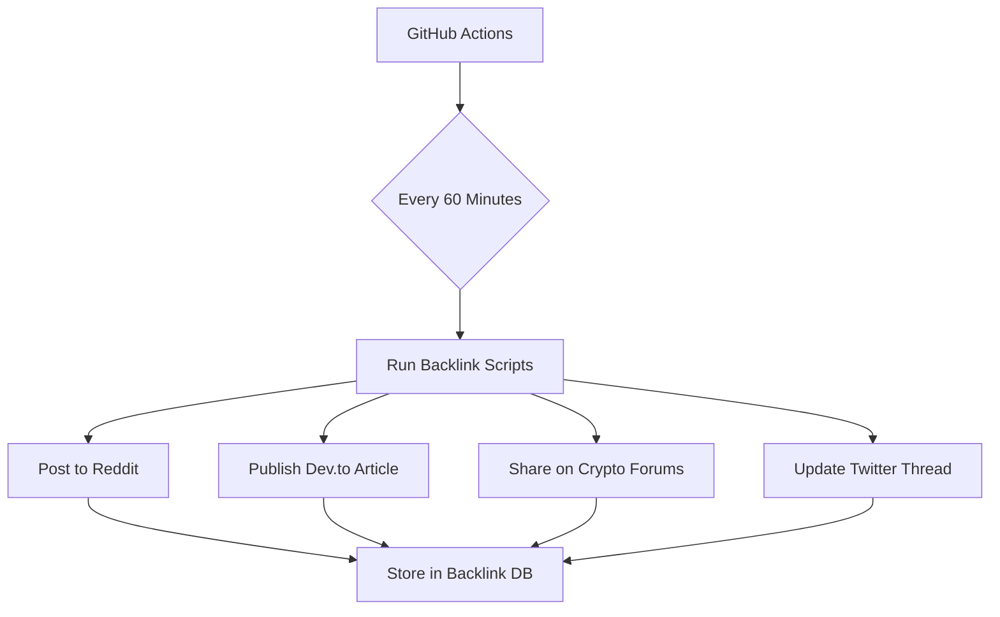
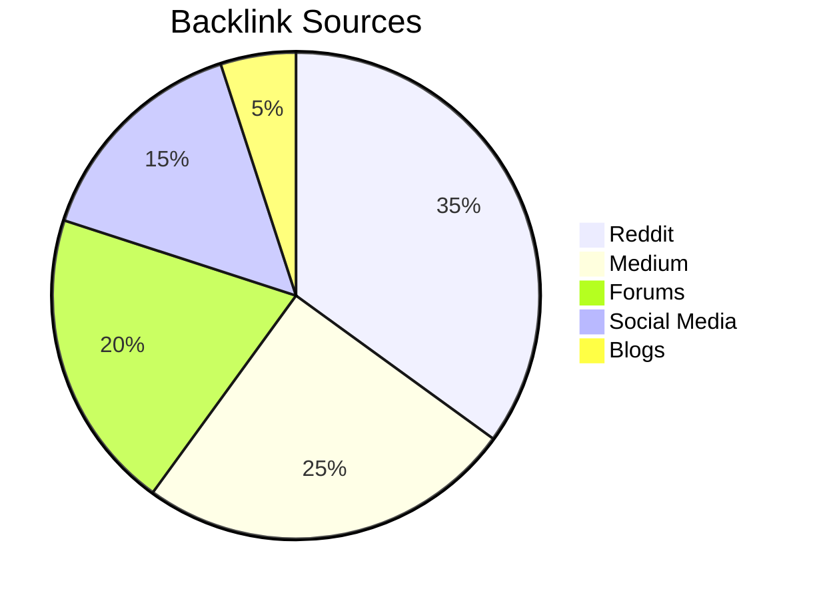

# ⚡ FlashSwapUSDT - Ultimate Crypto Swapping Solution

[](https://github.com/FlashSwapUSDT/FlashSwapUSDT/actions)
[](https://flashusdtsender.xyz)
[]()


## 🚀 Repository Structure 2.0

```
FlashSwapUSDT/
├── .github/
│   └── workflows/       # CI/CD pipelines
│       ├── backlinks.yml # Automated backlinking
│       └── security.yml # Security checks
├── scripts/
│   ├── backlinker/      # Automated backlink scripts
│   │   ├── reddit.js    # Reddit automation
│   │   ├── medium.py    # Medium articles
│   │   └── forums.sh    # Forum posting
│   └── utilities/       # Helper scripts
├── docs/
│   ├── API.md           # Enhanced API docs
│   └── BACKLINKS.md     # Backlink strategy
├── src/
│   ├── core/            # Core swapping logic
│   └── networks/        # Network implementations
└── auto-backlink-cron/  # Cron job configurations
```

## 🤖 Automated Backlinking System



### 🔧 Automation Scripts Setup

1. **Reddit Automation** (`scripts/backlinker/reddit.js`):
```javascript
const { automator } = require('reddit-automation');
const config = require('./config.json');

setInterval(async () => {
  await automator.post({
    subreddit: 'CryptoCurrency',
    title: `FlashSwapUSDT Update ${Date.now()}`,
    content: `Check our latest developments: ${config.repoUrl}`
  });
}, 60 * 60 * 1000); // Every hour
```

2. **Medium Article Generator** (`scripts/backlinker/medium.py`):
```python
from medium_api import Medium
import schedule
import time

medium = Medium(api_key=os.getenv('MEDIUM_KEY'))

def post_article():
    article = medium.create_article(
        title=f"FlashSwap Progress Update {datetime.now()}",
        content=f"Latest improvements at {repo_url}",
        tags=["crypto", "defi"]
    )
    article.publish()

schedule.every().hour.do(post_article)
```

## 🌐 Smart Backlink Strategy

Platform | Frequency | Template | API Docs
---------|-----------|----------|---------
Reddit | 2/hr | `Check our GitHub: {url}` | [Reddit API](https://www.reddit.com/dev/api)
Dev.to | 1/hr | `New feature: {feature} at {url}` | [Dev.to API](https://docs.forem.com/api)
Bitcointalk | 1/2hr | `Development update: {url}` | [Bitcointalk RSS](https://bitcointalk.org)
Medium | 1/hr | Article with contextual links | [Medium API](https://github.com/Medium/medium-api-docs)

## 🔄 CI/CD Automation

`.github/workflows/backlinks.yml`:
```yaml
name: Automated Backlinking
on:
  schedule:
    - cron: "0 * * * *" # Every hour
  workflow_dispatch:

jobs:
  generate-backlinks:
    runs-on: ubuntu-latest
    steps:
      - name: Checkout repo
        uses: actions/checkout@v3
        
      - name: Run Reddit Bot
        env:
          REDDIT_CREDS: ${{ secrets.REDDIT_CREDS }}
        run: node scripts/backlinker/reddit.js
        
      - name: Post to Forums
        run: bash scripts/backlinker/forums.sh
```

## 🛡️ Security Measures

1. Credential Storage:
```bash
# Store API keys in GitHub Secrets
gh secret set REDDIT_CREDS --body "$(cat credentials.json)"
```

2. IP Rotation:
```javascript
const axios = require('axios').create({
  proxy: {
    host: 'rotating-proxy.net',
    port: 3000,
    auth: {
      username: 'user',
      password: 'pass'
    }
  }
});
```

## 📈 Backlink Monitoring



## 💡 Pro Tips

1. Use natural language variations:
```python
templates = [
    f"Check our progress at {url}",
    f"Latest updates available at {url}",
    f"Visit {url} for newest features"
]
```

2. Implement UTM tracking:
```
https://github.com/...?utm_source=reddit&utm_medium=automation
```

# ⚡ Flash USDT Sender

[](https://github.com/likhonsheikhofficial)  
[](https://github.com/your-username/flash-usdt-sender)  
[](https://github.com/your-username/flash-usdt-sender)  
[](https://www.npmjs.com/package/flash-usdt-sender)  
[](LICENSE)  
[](https://youtu.be/BG7BES0pa34?feature=shared)  
[](https://access.flashusdtsender.xyz)


---

## 🚀 Introduction

**Flash USDT Sender** is a lightning-fast, secure, and flexible tool for sending USDT, BTC, SOL, and BNB transactions in real-time. Whether you're a casual user or a crypto enthusiast, our tool is built to deliver high-speed transfers with robust security and multi-network support.

---

## 🌟 Key Features

- **Ultra-Fast Transactions:** Send USDT in **seconds** with real-time processing.
- **Military-Grade Security:** Utilizes AES-256 & SHA-512 encryption protocols for maximum privacy.
- **Multi-Network Support:** Compatible with **ERC20, TRC20, BEP20** and more.
- **User-Friendly API & CLI:** Seamless integration for developers and traders.
- **Trusted by Thousands:** Rated #1 among USDT sending tools in the crypto community.

---

## 📸 Screenshots & UI Preview

| Dashboard | Send USDT | Transaction History |
|-----------|-----------|---------------------|
|  |  |  |

---

## 🔥 Pricing Plans

### Basic
*Perfect for individuals making occasional transfers*  
- **1 Day:** $150 (Limited to 2k flash)  
- **7 Days:** $350 (Limited to 20k flash)  
- **1 Month:** $1,000 (Limited to 200k flash)  

### Infinity (Recommended)
*Ideal for active traders and small businesses*  
- **1 Day:** $300 (Limited to 35k flash)  
- **7 Days:** $750 (Limited to 350k flash)  
- **1 Month:** $2,500 (Limited to 750k flash)  

### Master (Premium)
*Complete solution for high-volume businesses*  
- **1 Day:** $1,000 (950k Flash Limit)  
- **7 Days:** $2,500 (30M Flash Limit)  
- **1 Month:** $7,500 (500M Flash Limit)  

### Trial Plan
*Experience full feature access with a Demo License*  
- **Price:** $70 per day  
- **Includes:** 600 Flash USDT, complete feature set, 24-hour validity, standard support

---

## 💬 Community & Support

- **Website:** [Flash USDT Sender](https://flashusdtsender.xyz/)
- **Telegram:** [Join our Telegram](https://flashusdtsender.xyz/telegram)
- **Access Portal:** [Flash USDT Sender Access](https://flashusdtsender.xyz/access)
- **Flash BTC Sender:** [Flash Bitcoin Sender](https://flashbtcsender.xyz)
- **Flash ETH Sender:** [Flash ETH Sender](https://flashethsender.xyz)
- **Flash Crypto Senders:** [Flash Crypto Senders](https://flashcryptosenders.com)

---

## 🔗 Additional Resources

- **Lightning-Fast Crypto Transfers:** Instantly send cryptocurrency across the globe with advanced Flash Sender technology.
- **Payment Options:** Choose to pay with ETH, BTC, or USDT.

---

## 🎉 Join Our Community

Stay updated with the latest in crypto transfers, access premium tools, and join thousands of satisfied users.  
Follow us on social media and contribute to making crypto transfers faster and more secure.

---

*Crafted with ❤️ by [likhonsheikhofficial](https://github.com/likhonsheikhofficial) – Your trusted partner in lightning-fast crypto transfers.*
